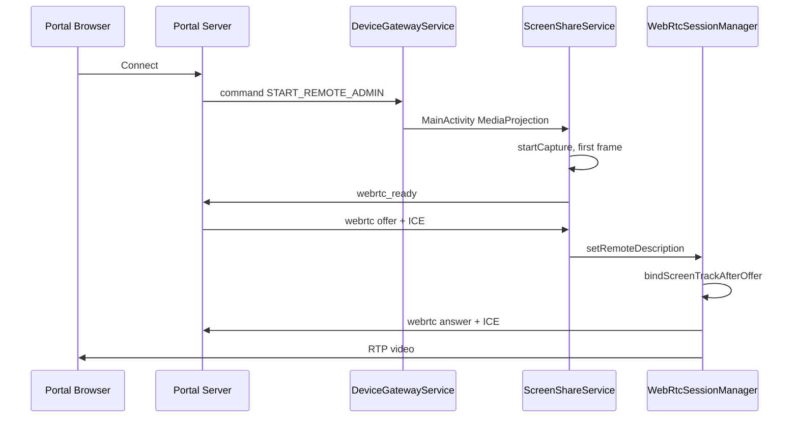

# EUD Remote Assist Android App — Complete Build Handoff

**Audience:** Android developers, agent implementers, and reviewers building or rebuilding the device client from scratch.  
**Reference implementation:** `/Users/michaelleckliter/AndroidStudioProjects/EUD_Remote_Assist`  
**Package / applicationId:** `com.cfd2474.eudremoteassist`  
**Current version:** `2.0.0` (build label `v2-doc-rebuild` in `BuildInfo.kt`)  
**Portal server (production):** `https://remote.tak-solutions.com:8448` (device API — **not** port 443)

This document explains **how to create the entire application**, step by step, in implementation order, with enough detail that a developer who has never seen the codebase can reproduce it. For protocol field definitions and server behavior, cross-read:

| Document | Purpose |
|----------|---------|
| [android-app-requirements.md](android-app-requirements.md) | Primary integration spec (REST, WS, WebRTC §8) |
| [android-webrtc-requirements.md](android-webrtc-requirements.md) | Condensed WebRTC quick reference |
| [android-webrtc-fix-handoff.md](android-webrtc-fix-handoff.md) | Historical failure modes + Fix #1C ordering |
| [android-control-handler-handoff.md](android-control-handler-handoff.md) | Touch/keyboard injection |
| [android-device-api-port-handoff.md](android-device-api-port-handoff.md) | Port 8448 cutover |
| [webrtc-protocol-reference.md](webrtc-protocol-reference.md) | Full signaling protocol |

---

## Table of contents

1. [What you are building](#1-what-you-are-building)
2. [Architecture](#2-architecture)
3. [Prerequisites](#3-prerequisites)
4. [Create the Android Studio project](#4-create-the-android-studio-project)
5. [Gradle configuration (exact)](#5-gradle-configuration-exact)
6. [Package layout and build order](#6-package-layout-and-build-order)
7. [Layer 1 — Configuration (`ManagedConfigManager`)](#7-layer-1--configuration-managedconfigmanager)
8. [Layer 2 — Network (`NetworkManager`)](#8-layer-2--network-networkmanager)
9. [Layer 3 — Session state (`RemoteSessionState`)](#9-layer-3--session-state-remotesessionstate)
10. [Layer 4 — Device gateway service](#10-layer-4--device-gateway-service)
11. [Layer 5 — Screen capture pipeline](#11-layer-5--screen-capture-pipeline)
12. [Layer 6 — WebRTC session manager](#12-layer-6--webrtc-session-manager)
13. [Layer 7 — Screen share service](#13-layer-7--screen-share-service)
14. [Layer 8 — MainActivity and MediaProjection](#14-layer-8--mainactivity-and-mediaprojection)
15. [Layer 9 — Remote control](#15-layer-9--remote-control)
16. [Layer 10 — Overlay, boot, device admin](#16-layer-10--overlay-boot-device-admin)
17. [AndroidManifest and permissions](#17-androidmanifest-and-permissions)
18. [MDM managed configuration](#18-mdm-managed-configuration)
19. [End-to-end remote assist timeline](#19-end-to-end-remote-assist-timeline)
20. [Message catalog (copy-paste JSON)](#20-message-catalog-copy-paste-json)
21. [Critical rules that must not be violated](#21-critical-rules-that-must-not-be-violated)
22. [Build, install, and test](#22-build-install-and-test)
23. [Logcat verification checklist](#23-logcat-verification-checklist)
24. [Common failures](#24-common-failures)
25. [File inventory (reference tree)](#25-file-inventory-reference-tree)

---

## 1. What you are building

The EUD Remote Assist app is a **managed Android device client** that:

1. **Registers** with the CFD Remote Assist Portal device API and stores a `connection_secret`.
2. **Maintains a persistent WebSocket** to `/ws/device` for instant admin commands and WebRTC signaling.
3. **Reports telemetry** (location, battery) on an MDM-configured interval and via **30-second command poll** fallback.
4. On admin **Connect**, performs **screen capture + WebRTC** so the portal browser can view the device screen.
5. Accepts **remote touch and keyboard** input via WebSocket `control` messages (AccessibilityService).
6. Shows **visual overlays** during remote sessions so the user knows assist is active.
7. Supports admin commands: `START_REMOTE_ADMIN`, `STOP_REMOTE_ADMIN`, `LOCK_DEVICE`, `REQUEST_LOCATION`, `TRIGGER_PING`, `RESYNC_DEVICE_INFO`.

The app is **not** a general-purpose MDM agent. It is tightly coupled to the portal’s message shapes on port **8448**.

---

## 2. Architecture

Two foreground services split responsibilities deliberately:

```
┌─────────────────────────────────────────────────────────────────────────┐
│                         MainActivity (Compose UI)                        │
│  - Registration / server URL / permission shortcuts                      │
│  - MediaProjection consent (fresh Intent per remote session)             │
└───────────────────────────────┬─────────────────────────────────────────┘
                                │ starts
                                ▼
┌─────────────────────────────────────────────────────────────────────────┐
│              DeviceGatewayService  (FGS type: location)                  │
│  - WebSocket auth + keepalive                                            │
│  - Command poll every 30s                                                │
│  - Telemetry from FusedLocationProvider                                  │
│  - Routes: command | webrtc | control | signaling_hint                   │
│  - NEVER reconnects WS during active remote session                      │
└───────┬─────────────────────────────┬───────────────────────────────────┘
        │ START_REMOTE_ADMIN          │ webrtc JSON
        ▼                             ▼
┌──────────────────┐    ┌─────────────────────────────────────────────────┐
│  OverlayService  │    │     ScreenShareService (FGS: mediaProjection)    │
│  (visual banner) │    │  ScreenCapturePipeline → VideoTrack              │
└──────────────────┘    │  WebRtcSessionManager → PeerConnection           │
                        │  Signaling poll every 2s (HTTP fallback)          │
                        └─────────────────────────────────────────────────┘
```

**Why two services?** The gateway must stay alive and keep the **same WebSocket** open while screen capture runs in a separate `mediaProjection` foreground service. Reconnecting the WebSocket mid-session breaks ICE/signaling and is explicitly forbidden by the portal spec.

**Singleton `NetworkManager`:** Both services share one OkHttp client and one WebSocket instance via `NetworkManager.getInstance(context, config)`.

---

## 3. Prerequisites

### 3.1 Development machine

| Requirement | Version (reference impl) |
|-------------|--------------------------|
| Android Studio | Ladybug or newer recommended |
| JDK | 11+ (project uses Java 11 bytecode) |
| Android SDK | API 36 compile, minSdk 26, targetSdk 36 |
| Gradle | Wrapper included in project (`./gradlew`) |

### 3.2 Server access

- A reachable portal device API base URL, e.g. `https://remote.tak-solutions.com:8448`
- TLS must validate (Let’s Encrypt on production)
- Test device will appear on admin portal after successful `POST /api/v1/register`

### 3.3 Device / EMM

- Physical device or emulator with Google Play services (for Fused Location)
- For production remote control: user must enable **Accessibility Service** and **Display over other apps**
- For `LOCK_DEVICE`: app must be **device admin** (optional but recommended on managed fleet)
- MDM should push `tracking_server_url` and `connection_secret` after first registration

### 3.4 Key third-party libraries

| Library | Maven coordinate | Role |
|---------|------------------|------|
| WebRTC | `io.github.webrtc-sdk:android:144.7559.09` | PeerConnection, screen capturer |
| OkHttp | `com.squareup.okhttp3:okhttp:4.12.0` | REST + WebSocket |
| Gson | `com.google.code.gson:gson:2.10.1` | JSON |
| Play Services Location | `com.google.android.gms:play-services-location:21.3.0` | Fused location |
| Jetpack Compose | BOM `2026.02.01` | Main UI |

---

## 4. Create the Android Studio project

### 4.1 New project wizard

1. **File → New → New Project**
2. Template: **Empty Activity** (Compose) *or* Empty Views Activity (you will add Compose manually)
3. Name: `EUD Remote Assist`
4. Package name: `com.cfd2474.eudremoteassist` (or your org package — update all references consistently)
5. Language: **Kotlin**
6. Minimum SDK: **API 26**
7. Save to: `AndroidStudioProjects/EUD_Remote_Assist`

### 4.2 Replace default structure

Delete boilerplate you will not use (e.g. default `Theme.kt` parent if it references MaterialComponents incorrectly). The reference project uses:

```
EUD_Remote_Assist/
├── app/
│   ├── build.gradle.kts
│   └── src/main/
│       ├── AndroidManifest.xml
│       ├── java/com/cfd2474/eudremoteassist/   … all Kotlin sources
│       └── res/
├── gradle/
│   └── libs.versions.toml
├── build.gradle.kts
├── settings.gradle.kts
└── gradle.properties
```

### 4.3 Enable version catalog

Ensure `settings.gradle.kts` uses `dependencyResolutionManagement` with `google()` and `mavenCentral()` — see reference `settings.gradle.kts`.

---

## 5. Gradle configuration (exact)

### 5.1 Root `build.gradle.kts`

```kotlin
plugins {
    alias(libs.plugins.android.application) apply false
    alias(libs.plugins.kotlin.compose) apply false
}
```

### 5.2 `gradle/libs.versions.toml` (full)

Copy from reference implementation. Critical pins:

```toml
[versions]
agp = "9.2.1"
kotlin = "2.2.10"
coreKtx = "1.15.0"          # Do NOT use 1.19+ unless compileSdk >= 37
webrtc = "144.7559.09"
okhttp = "4.12.0"
gson = "2.10.1"
playServicesLocation = "21.3.0"
composeBom = "2026.02.01"

[libraries]
google-webrtc = { group = "io.github.webrtc-sdk", name = "android", version.ref = "webrtc" }
# … see reference file for full list

[plugins]
android-application = { id = "com.android.application", version.ref = "agp" }
kotlin-compose = { id = "org.jetbrains.kotlin.plugin.compose", version.ref = "kotlin" }
```

### 5.3 `app/build.gradle.kts`

```kotlin
plugins {
    alias(libs.plugins.android.application)
    alias(libs.plugins.kotlin.compose)
}

android {
    namespace = "com.cfd2474.eudremoteassist"
    compileSdk {
        version = release(36) { minorApiLevel = 1 }
    }
    defaultConfig {
        applicationId = "com.cfd2474.eudremoteassist"
        minSdk = 26
        targetSdk = 36
        versionCode = 1
        versionName = "2.0.0"
    }
    buildFeatures { compose = true }
    compileOptions {
        sourceCompatibility = JavaVersion.VERSION_11
        targetCompatibility = JavaVersion.VERSION_11
    }
}

dependencies {
    implementation(platform(libs.androidx.compose.bom))
    implementation(libs.androidx.activity.compose)
    implementation(libs.androidx.compose.material3)
    implementation(libs.androidx.compose.ui)
    implementation(libs.androidx.core.ktx)
    implementation(libs.androidx.lifecycle.runtime.ktx)
    implementation(libs.androidx.lifecycle.service)
    implementation(libs.google.play.services.location)
    implementation(libs.okhttp)
    implementation(libs.google.webrtc)
    implementation(libs.gson)
}
```

### 5.4 First successful build

```bash
cd /path/to/EUD_Remote_Assist
./gradlew :app:assembleDebug
```

APK output: `app/build/outputs/apk/debug/app-debug.apk`

---

## 6. Package layout and build order

Implement in this order so each layer compiles and can be tested incrementally:

| Step | Package / class | Depends on |
|------|-----------------|------------|
| 1 | `config/ManagedConfigManager.kt` | Android SDK |
| 2 | `network/NetworkManager.kt` | ManagedConfigManager |
| 3 | `session/RemoteSessionState.kt` | — |
| 4 | `service/DeviceGatewayService.kt` | NetworkManager, config |
| 5 | `MainActivity.kt` (minimal — start gateway + register) | NetworkManager |
| 6 | `webrtc/ScreenCapturePipeline.kt` | WebRTC SDK |
| 7 | `webrtc/WebRtcSessionManager.kt` | NetworkManager, WebRTC SDK |
| 8 | `service/ScreenShareService.kt` | pipeline + session manager |
| 9 | Wire `START_REMOTE_ADMIN` in gateway → MainActivity projection | all above |
| 10 | `remote/*` + `RemoteAssistAccessibilityService` | Accessibility APIs |
| 11 | `OverlayService`, receivers, manifest permissions | — |

---

## 7. Layer 1 — Configuration (`ManagedConfigManager`)

**File:** `app/src/main/java/.../config/ManagedConfigManager.kt`

### 7.1 Responsibility

Read MDM **managed configuration** (Android Enterprise `RestrictionsManager`) and fall back to encrypted-ish local prefs for manual QA builds.

### 7.2 MDM keys (must match `res/xml/app_restrictions.xml`)

| Key | Type | Usage |
|-----|------|-------|
| `tracking_server_url` | string | Base URL for **all** HTTP/WS — e.g. `https://remote.tak-solutions.com:8448` |
| `connection_secret` | string | Usually pushed by EMM after first register; app caches locally |
| `tracking_interval` | integer | Minutes between location reports (default 15) |
| `settings_password` | string | Optional PIN for local settings |
| `agency` | string | Organization name sent on register |

### 7.3 Implementation rules

- **`getTrackingServerUrl()`** — trim trailing `/`. Prefer MDM value over manual pref.
- **`getConnectionSecret()`** — read from `SharedPreferences` key `cached_connection_secret` (set after register response).
- **`clearConnectionSecret()`** — on HTTP 401, force re-registration flow.
- Listen for `Intent.ACTION_APPLICATION_RESTRICTIONS_CHANGED` in gateway service to reload interval/URL.

### 7.4 Manifest hook

```xml
<meta-data
    android:name="android.content.APP_RESTRICTIONS"
    android:resource="@xml/app_restrictions" />
```

---

## 8. Layer 2 — Network (`NetworkManager`)

**File:** `app/src/main/java/.../network/NetworkManager.kt`

Singleton. Thread-safe lazy init:

```kotlin
NetworkManager.getInstance(context.applicationContext, config)
```

### 8.1 REST endpoints implemented

| Method | Path | Auth | Body / notes |
|--------|------|------|--------------|
| POST | `/api/v1/register` | None | `{ uid, device_name, model, app_version, agency, … }` → stores `connection_secret` |
| POST | `/api/v1/telemetry` | `X-Connection-Secret` | Location + battery; response may include `commands[]` |
| POST | `/api/v1/event` | `X-Connection-Secret` | `{ uid, event, payload }` — **not** for WebRTC |
| GET | `/api/v1/commands` | `X-Connection-Secret` | Poll fallback every 30s |
| GET | `/api/v1/signaling` | `X-Connection-Secret` | Poll admin offers/ICE during session |
| POST | `/api/v1/signaling` | `X-Connection-Secret` | Post SDP answer + device ICE **only** |

### 8.2 WebSocket

**URL construction:**

```kotlin
val wsUrl = baseUrl
    .replace("https://", "wss://")
    .replace("http://", "ws://")
    .trimEnd('/') + "/ws/device"
```

**First message after `onOpen` (within 10 seconds or server closes with 4001):**

```json
{ "type": "auth", "uid": "<ANDROID_ID>", "connection_secret": "<hex>" }
```

**Keepalive every ~45s:**

```json
{ "type": "ping" }
```

### 8.3 `sendWebSocket` fallback policy

| Message type | WS down behavior |
|--------------|------------------|
| `webrtc` (answer/ICE) | **HTTP POST** `/api/v1/signaling` |
| `webrtc_ready` | **Drop** — must not POST (server rejects misuse) |
| `device_event` | **Drop** — use REST `/api/v1/event` instead |

### 8.4 Session guard

```kotlin
fun setRemoteSessionActive(active: Boolean)
fun isRemoteSessionActive(): Boolean
```

Gateway checks this before reconnecting WebSocket.

---

## 9. Layer 3 — Session state (`RemoteSessionState`)

**File:** `app/src/main/java/.../session/RemoteSessionState.kt`

Volatile fields shared across services:

```kotlin
object RemoteSessionState {
    @Volatile var isSessionActive: Boolean = false
    @Volatile var captureWidth: Int = 0      // WebRTC buffer (typically display/2)
    @Volatile var captureHeight: Int = 0
    @Volatile var displayWidth: Int = 0      // Physical pixels — for touch + ORIENTATION_CHANGED
    @Volatile var displayHeight: Int = 0
}
```

**Critical distinction:** Remote control must use **`displayWidth/Height`**, not capture dimensions. See [android-control-handler-handoff.md](android-control-handler-handoff.md).

---

## 10. Layer 4 — Device gateway service

**File:** `app/src/main/java/.../service/DeviceGatewayService.kt`

### 10.1 Foreground service

- Notification channel: `device_gateway`
- `foregroundServiceType="location"` (Android 10+)
- `START_STICKY` — Android should restart if killed

### 10.2 Startup (`MainActivity.onCreate`)

```kotlin
startForegroundService(Intent(this, DeviceGatewayService::class.java))
```

### 10.3 WebSocket message dispatch

```kotlin
when (type) {
    "auth_ok" -> …
    "pong" -> …
    "command" -> verify connection_secret → handleCommand()
    "webrtc" -> forwardSignaling()  // to ScreenShareService
    "signaling_hint" -> log only
    "control" -> RemoteControlHandler
}
```

**Important:** Do **not** require `connection_secret` on inbound `webrtc` messages to route them — the server adds it, but dropping messages when parsing fails breaks ICE delivery. The reference impl forwards all `webrtc` to screen share service.

### 10.4 Commands

| Command | Action |
|---------|--------|
| `START_REMOTE_ADMIN` | `wakeDevice()` → set session active → start `OverlayService` → launch `MainActivity` with `ACTION_REQUEST_PROJECTION` |
| `STOP_REMOTE_ADMIN` | Stop overlay + screen share, reset session |
| `LOCK_DEVICE` | End remote assist → HOME → `DevicePolicyManager.lockNow()` if admin |
| `REQUEST_LOCATION` | One-shot fused location → telemetry |
| `TRIGGER_PING` | POST event `PING_COMPLETED` |
| `RESYNC_DEVICE_INFO` | Re-POST register |

### 10.5 WebSocket reconnect policy

Every 45 seconds:

- If connected → send ping
- If disconnected **and** `!isRemoteSessionActive && !RemoteSessionState.isSessionActive` → reconnect
- If disconnected **during** session → **log and wait** (do not reconnect)

---

## 11. Layer 5 — Screen capture pipeline

**File:** `app/src/main/java/.../webrtc/ScreenCapturePipeline.kt`

### 11.1 Inputs

- **`projectionData: Intent`** — the **exact** result `Intent` from `MediaProjectionManager.createScreenCaptureIntent()` user approval. **Single-use per session.** Never cache across `STOP`/`START`.

### 11.2 Wiring (mandatory order)

```kotlin
eglBase = EglBase.create()
capturer = ScreenCapturerAndroid(projectionData, MediaProjection.Callback())
videoSource = factory.createVideoSource(capturer.isScreencast)  // isScreencast MUST be true
surfaceHelper = SurfaceTextureHelper.create("ScreenCapture", eglBase.eglBaseContext)
capturer.initialize(surfaceHelper, context, frameForwardingObserver)
capturer.startCapture(captureWidth, captureHeight, 30)   // non-zero dimensions
videoTrack = factory.createVideoTrack("screen0", videoSource)
videoTrack.setEnabled(true)
```

### 11.3 Resolution

Default: **half** physical display size (bandwidth):

```kotlin
captureWidth = bounds.width() / 2
captureHeight = bounds.height() / 2
```

Store both capture and display sizes in `RemoteSessionState`.

### 11.4 First frame gate

Wrap `CapturerObserver.onFrameCaptured`:

```kotlin
if (!firstFrameSeen) {
    firstFrameSeen = true
    Log.i(TAG, "FIRST FRAME ${frame.rotatedWidth}x${frame.rotatedHeight}")
    Handler(Looper.getMainLooper()).post { onFirstFrame() }
}
```

**`onFirstFrame` callback must trigger `webrtc_ready`** — not before. Sending `webrtc_ready` on permission grant alone causes the portal to offer before capture runs → black video.

### 11.5 Rotation

On `ScreenShareService.onConfigurationChanged`:

```kotlin
capturer.changeCaptureFormat(newW, newH, 30)
videoSource.adaptOutputFormat(newW, newH, 30)
videoTrack.setEnabled(false); videoTrack.setEnabled(true)  // encoder kick
```

Send `ORIENTATION_CHANGED` device event with **display** width/height.

---

## 12. Layer 6 — WebRTC session manager

**File:** `app/src/main/java/.../webrtc/WebRtcSessionManager.kt`

This class encodes **Fix #1C** from [android-webrtc-fix-handoff.md](android-webrtc-fix-handoff.md).

### 12.1 PeerConnection creation

```kotlin
PeerConnection.RTCConfiguration(listOf(
    PeerConnection.IceServer.builder("stun:stun.l.google.com:19302").createIceServer()
)).apply {
    sdpSemantics = PeerConnection.SdpSemantics.UNIFIED_PLAN
    continualGatheringPolicy = PeerConnection.ContinualGatheringPolicy.GATHER_CONTINUALLY
}
```

Create **one** `PeerConnection` per session. **No video track at creation time.**

### 12.2 Offer handling (exact sequence)

```
1. Receive { type:"webrtc", sdp:{ type:"offer", sdp:"…" } }
2. Ignore duplicate offer SDP string (same session)
3. peerConnection.setRemoteDescription(offer)
4. ON SUCCESS:
   a. remoteDescriptionSet = true
   b. flushPendingRemoteIce()
   c. bindScreenTrackAfterOffer()    ← MUST happen here
   d. createAnswer()
   e. setLocalDescription(answer)
   f. send answer on WS + HTTP POST signaling
```

### 12.3 `bindScreenTrackAfterOffer()` — the most important function

```kotlin
private fun bindScreenTrackAfterOffer() {
    val track = localVideoTrackProvider() ?: return
    val videoTx = pc.transceivers.find { it.mediaType == MEDIA_TYPE_VIDEO }
    if (videoTx != null) {
        videoTx.sender.setTrack(track, false)
        videoTx.direction = RtpTransceiverDirection.SEND_ONLY
    } else {
        pc.addTrack(track, listOf("stream0"))
    }
}
```

**NEVER call `addTransceiver(SEND_ONLY)` or `addTrack` before `setRemoteDescription(offer)`.**  
Pre-binding causes answers missing `a=sendonly` and `a=msid:` → portal black screen despite ICE CONNECTED.

### 12.4 ICE — remote (browser → device)

Buffer until remote description set:

```kotlin
if (!remoteDescriptionSet) pendingRemoteIce.add(candidate)
else pc.addIceCandidate(candidate)
```

### 12.5 ICE — local (device → browser)

In `onIceCandidate`, send **every** candidate:

```json
{
  "type": "webrtc",
  "ice": {
    "candidate": "candidate:…",
    "sdpMid": "0",
    "sdpMLineIndex": 0
  }
}
```

Also `postSignaling()` each one.

### 12.6 `onRenegotiationNeeded`

**Ignore.** Portal sends one offer per session. Device-initiated renegotiation breaks the admin recv path.

### 12.7 Verification log line

After `createAnswer`:

```
Answer created (sendonly=true, msid=true, len=…)
```

If `sendonly=false` or `msid=false`, **stop and fix track binding order** before testing further.

---

## 13. Layer 7 — Screen share service

**File:** `app/src/main/java/.../service/ScreenShareService.kt`

### 13.1 Actions

| Action constant | Purpose |
|-----------------|---------|
| `ACTION_START` | Begin session; extras: `EXTRA_RESULT_CODE`, `EXTRA_RESULT_DATA` |
| `ACTION_STOP` | Teardown + `stopSelf()` |
| `ACTION_SIGNAL` | Extra `EXTRA_SIGNAL` = JSON string from gateway |

### 13.2 Threading

- `PeerConnectionFactory.initialize` and capture start on **background executor**
- UI notification updates on main `Handler`
- Signaling poll every **2 seconds** via `GET /api/v1/signaling`

### 13.3 Signaling buffer

If `webrtc` messages arrive before `WebRtcSessionManager` is ready, queue strings in `signalingBuffer` and flush after first frame + `webrtc_ready`.

### 13.4 Foreground service type

Android 10+:

```kotlin
startForeground(id, notification, ServiceInfo.FOREGROUND_SERVICE_TYPE_MEDIA_PROJECTION)
```

Manifest must declare `FOREGROUND_SERVICE_MEDIA_PROJECTION`.

### 13.5 Teardown (idempotent)

On stop/destroy:

1. Cancel signaling poll
2. `webrtc.dispose()` — closes PeerConnection
3. `capture.stop()` — stops VirtualDisplay
4. `factory.dispose()`
5. `RemoteSessionState.reset()`
6. `network.setRemoteSessionActive(false)`
7. Send `REMOTE_SESSION_STOPPED` via WS + REST event

---

## 14. Layer 8 — MainActivity and MediaProjection

**File:** `app/src/main/java/.../MainActivity.kt`

### 14.1 Compose UI (minimal)

Display:

- Device UID (`Settings.Secure.ANDROID_ID`)
- Build label (`BuildInfo.LABEL`)
- Server URL field (hidden when MDM-managed)
- Register button
- Shortcuts to Accessibility settings and overlay permission

### 14.2 Start gateway on launch

Always call `startForegroundService(DeviceGatewayService)` in `onCreate`.

### 14.3 MediaProjection flow

```kotlin
// Triggered by gateway with action ACTION_REQUEST_PROJECTION
val mgr = getSystemService(MEDIA_PROJECTION_SERVICE) as MediaProjectionManager
projectionLauncher.launch(mgr.createScreenCaptureIntent())

// In result callback:
startForegroundService(Intent(this, ScreenShareService::class.java).apply {
    action = ScreenShareService.ACTION_START
    putExtra(EXTRA_RESULT_CODE, result.resultCode)
    putExtra(EXTRA_RESULT_DATA, result.data)  // parcelable Intent
})
moveTaskToBack(true)
```

Use `getParcelableExtra(..., Intent::class.java)` on API 33+.

### 14.4 Runtime permissions

Request on first launch:

- `ACCESS_FINE_LOCATION`, `ACCESS_COARSE_LOCATION`
- `ACCESS_BACKGROUND_LOCATION` (API 29+)
- `POST_NOTIFICATIONS` (API 33+)

---

## 15. Layer 9 — Remote control

### 15.1 Accessibility service

**File:** `service/RemoteAssistAccessibilityService.kt`  
**Config:** `res/xml/accessibility_service_config.xml` — must set `android:canPerformGestures="true"`.

Hold singleton `instance` reference for gateway to invoke handler.

### 15.2 `RemoteControlHandler`

**File:** `remote/RemoteControlHandler.kt`

Convert normalized coordinates:

```kotlin
x = x_percent * displayWidth   // NOT captureWidth
y = y_percent * displayHeight
```

Actions: `CLICK`, `SWIPE`, `LONG_PRESS`, `KEY` — see [android-control-handler-handoff.md](android-control-handler-handoff.md).

### 15.3 Key injection

`KeyInjector` chain: Accessibility text injection first, shell `input keyevent` fallback for device-owner builds.

---

## 16. Layer 10 — Overlay, boot, device admin

| Component | File | Role |
|-----------|------|------|
| `OverlayService` | `service/OverlayService.kt` | Blue status bar tint + “Remote Assist Active” banner (`TYPE_APPLICATION_OVERLAY`) |
| `BootReceiver` | `receiver/BootReceiver.kt` | Start gateway if `config.isBootStartEnabled()` |
| `DeviceAdminReceiver` | `receiver/DeviceAdminReceiver.kt` | `force-lock` policy for `LOCK_DEVICE` |

---

## 17. AndroidManifest and permissions

Full reference: `app/src/main/AndroidManifest.xml`

### 17.1 Permission matrix

| Permission | Why |
|------------|-----|
| `INTERNET` | REST + WSS |
| `ACCESS_FINE/COARSE_LOCATION` | Telemetry |
| `ACCESS_BACKGROUND_LOCATION` | Telemetry while app backgrounded |
| `FOREGROUND_SERVICE` + typed (`LOCATION`, `MEDIA_PROJECTION`, `SPECIAL_USE`) | Android 14+ compliance |
| `POST_NOTIFICATIONS` | FG service notifications |
| `SYSTEM_ALERT_WINDOW` | OverlayService |
| `WAKE_LOCK` | Wake screen on remote start |
| `RECEIVE_BOOT_COMPLETED` | Optional auto-start |

### 17.2 Service declarations

```xml
<service android:name=".service.DeviceGatewayService"
    android:foregroundServiceType="location" />

<service android:name=".service.ScreenShareService"
    android:foregroundServiceType="mediaProjection"
    android:configChanges="orientation|screenSize|screenLayout" />
```

`configChanges` on `ScreenShareService` delivers rotation to `onConfigurationChanged` without killing the projection.

---

## 18. MDM managed configuration

### 18.1 Restrictions XML

`res/xml/app_restrictions.xml` — keys must match `ManagedConfigManager` string literals exactly.

### 18.2 Typical EMM workflow

1. Install APK via managed Play or sideload
2. App registers → displays / reports `connection_secret` (out of band to admin)
3. Admin pushes managed config:
   - `tracking_server_url` = `https://remote.tak-solutions.com:8448`
   - `connection_secret` = hex from register
   - `tracking_interval` = 15
4. Device reconnects WS with secret; appears **Live** on portal

---

## 19. End-to-end remote assist timeline

Target: video within **15 seconds** of admin Connect.

```
T+0.0s   Admin Connect → server WS command START_REMOTE_ADMIN (+ connection_secret)
T+0.1s   Server may send signaling_hint (informational)
T+0.1s   Device: gateway wakes screen, overlay, MainActivity projection dialog
T+2-10s  User taps "Start now" on system screen capture dialog
T+2-10s  ScreenShareService starts capture at display/2 resolution
T+2-11s  FIRST FRAME → device sends { type: "webrtc_ready" } ONCE
T+2-14s  Portal sends offer (recvonly video) + trickle ICE
T+2-14s  Device: setRemoteDescription → bind track → answer + ICE
T+3-15s  ICE CONNECTED → RTP flows → portal shows video
```

Mermaid sequence:



---

## 20. Message catalog (copy-paste JSON)

### 20.1 WebSocket auth (device → server)

```json
{ "type": "auth", "uid": "568b166b3dd461eb", "connection_secret": "a1b2c3…" }
```

### 20.2 WebRTC ready (device → server)

```json
{ "type": "webrtc_ready" }
```

### 20.3 SDP answer (device → server)

```json
{
  "type": "webrtc",
  "sdp": { "type": "answer", "sdp": "v=0\r\no=…" }
}
```

### 20.4 ICE candidate (device → server)

```json
{
  "type": "webrtc",
  "ice": {
    "candidate": "candidate:842163049 1 udp …",
    "sdpMid": "0",
    "sdpMLineIndex": 0
  }
}
```

### 20.5 Offer (server → device)

```json
{
  "type": "webrtc",
  "connection_secret": "a1b2c3…",
  "sdp": { "type": "offer", "sdp": "v=0\r\n…" }
}
```

### 20.6 Device event — orientation

```json
{
  "type": "device_event",
  "uid": "568b166b3dd461eb",
  "event": "ORIENTATION_CHANGED",
  "payload": { "width": 2340, "height": 1080, "orientation": "landscape" }
}
```

### 20.7 Control click (server → device)

```json
{
  "type": "control",
  "action": "CLICK",
  "x_percent": 0.52,
  "y_percent": 0.41,
  "stream_width": 540,
  "stream_height": 1200
}
```

Use **display** pixels for injection, not `stream_width/height`.

---

## 21. Critical rules that must not be violated

| # | Rule | Violation symptom |
|---|------|-------------------|
| 1 | **`webrtc_ready` only after first captured frame** | Portal offers early; 0×0 / black video |
| 2 | **Fresh MediaProjection Intent every session** | Silent capture failure, no frames |
| 3 | **No `addTrack` / `addTransceiver(SEND)` before portal offer** | Answer missing sendonly/msid; black video |
| 4 | **Bind track after `setRemoteDescription`, before `createAnswer`** | Same as #3 |
| 5 | **Send every local ICE candidate** | Portal “Device ICE: 0”, stuck negotiating |
| 6 | **Buffer + apply all remote ICE candidates** | ICE stuck in CHECKING |
| 7 | **Do not reconnect WebSocket during remote session** | Signaling loss, failed reconnect |
| 8 | **Never POST `device_event` to `/api/v1/signaling`** | Server “Signaling POST rejected” |
| 9 | **Use port 8448 for device API** | Device invisible on dashboard |
| 10 | **Touch map uses display size, not capture size** | Clicks offset ~50% |
| 11 | **Ignore `onRenegotiationNeeded` for initial session** | Portal NO_RTP / pending renegotiation |
| 12 | **`videoSource = createVideoSource(isScreencast = true)`** | Poor encoding / wrong content hint |

---

## 22. Build, install, and test

### 22.1 Build commands

```bash
cd AndroidStudioProjects/EUD_Remote_Assist
./gradlew :app:assembleDebug          # APK
./gradlew :app:installDebug           # Install on connected device
./gradlew :app:compileDebugKotlin     # Compile check only
```

### 22.2 Manual test script

1. Launch app → enter server URL → **Save & Register**
2. Enable Accessibility + overlay permissions
3. Confirm device **Live** on portal
4. Admin → **Connect**
5. Grant screen capture on device
6. Confirm video within ~15s
7. Admin → click center of screen → verify tap on device
8. Admin → **Disconnect** → overlays clear

### 22.3 curl registration (host machine)

```bash
curl -sS -X POST https://remote.tak-solutions.com:8448/api/v1/register \
  -H 'Content-Type: application/json' \
  -d '{"uid":"test-001","device_name":"Test Device"}'
```

---

## 23. Logcat verification checklist

Filter tags: `DeviceGateway`, `ScreenShare`, `ScreenCapture`, `WebRtcSession`, `NetworkManager`, `RemoteControl`

| Step | Expected log |
|------|--------------|
| App start | `WebSocket open — sending auth` → `WebSocket authenticated` |
| Register | HTTP 200/201, secret stored |
| START_REMOTE_ADMIN | `Command: START_REMOTE_ADMIN` |
| Projection granted | `Starting screen share session (fresh projection)` |
| Capture | `Starting capture 540x1200` → `Capturer started: true` |
| First frame | `FIRST FRAME 540x1200` |
| Ready | `First frame — sending webrtc_ready` |
| Offer | `Processing portal offer` → `Remote description set` |
| Track bind | `Bound screen track to offer transceiver (sendonly)` |
| Answer | **`Answer created (sendonly=true, msid=true, len=…)`** |
| ICE | `Local ICE:` lines + `ICE: CONNECTED` |
| Session | `REMOTE_SESSION_STARTED` |
| Control | `CLICK x,y (1080x2400)` using display dimensions |

### 23.1 Red flags (stop and debug)

- `Answer created (sendonly=false, msid=false, …)` — track binding order wrong
- `Renegotiation Needed` immediately after answer — track added too early
- `WebSocket open` within 5s of answer during same session — WS reconnect bug
- No `FIRST FRAME` before `webrtc_ready` — ready sent too early
- `CLICK` coordinates ≈ half of display — using capture size for touch

---

## 24. Common failures

| Symptom | Root cause | Fix |
|---------|------------|-----|
| Device not on dashboard | Wrong port (443) or no register | Use `:8448`, call register |
| Stuck “Waiting for stream” | No `webrtc_ready` or no capture | Wait for first frame before ready |
| Answer received, no video, ICE connected | Bad SDP answer (no sendonly/msid) | Fix #1C ordering |
| Device ICE: 0 on portal | Not sending `onIceCandidate` | Wire ICE callback |
| ICE stuck CHECKING | Remote ICE not applied / not buffered | §12.4 |
| Signaling POST rejected | Posted device_event to signaling API | Use `/api/v1/event` |
| Clicks wrong position | captureWidth used for touch | Use displayWidth |
| Black after rotation | Encoder stall on Samsung | `changeCaptureFormat` + encoder kick |
| WS reconnect mid-session | Gateway reconnect logic | Guard with session flags |

---

## 25. File inventory (reference tree)

```
app/src/main/java/com/cfd2474/eudremoteassist/
├── BuildInfo.kt                          # Debug footer label
├── MainActivity.kt                       # UI + MediaProjection launcher
├── config/
│   └── ManagedConfigManager.kt           # MDM + prefs
├── network/
│   └── NetworkManager.kt                 # REST + WS + signaling POST/GET
├── session/
│   └── RemoteSessionState.kt             # Shared session dimensions/flags
├── webrtc/
│   ├── ScreenCapturePipeline.kt          # MediaProjection → VideoTrack
│   └── WebRtcSessionManager.kt           # Offer/answer/ICE (Fix #1C)
├── service/
│   ├── DeviceGatewayService.kt           # Persistent gateway
│   ├── ScreenShareService.kt             # Per-session capture + WebRTC
│   ├── OverlayService.kt                 # Visual indicators
│   └── RemoteAssistAccessibilityService.kt
├── remote/
│   ├── RemoteControlHandler.kt
│   ├── KeyInjector.kt
│   └── PortalKeyParser.kt
├── receiver/
│   ├── BootReceiver.kt
│   └── DeviceAdminReceiver.kt
└── ui/theme/
    └── Theme.kt

app/src/main/res/
├── xml/app_restrictions.xml                # MDM schema
├── xml/accessibility_service_config.xml
├── xml/device_admin.xml
└── values/strings.xml

Reference APK project path:
  /Users/michaelleckliter/AndroidStudioProjects/EUD_Remote_Assist
```

---

## Appendix A — Implementing from zero without copying code

If you cannot copy the reference repo, follow **§6 build order** and for each class:

1. Read the matching **§7–§16** section in this document
2. Read the corresponding section in [android-app-requirements.md](android-app-requirements.md)
3. Implement the minimum methods listed
4. Run **§23 logcat checklist** after each layer

Minimum viable remote view requires only: `ManagedConfigManager`, `NetworkManager`, `DeviceGatewayService`, `ScreenShareService`, `ScreenCapturePipeline`, `WebRtcSessionManager`, `MainActivity` projection — roughly **~1,200 lines Kotlin** in the reference build.

---

## Appendix B — Version bumps

When shipping fixes:

- Increment `versionCode` monotonically in `app/build.gradle.kts`
- Update `versionName` semver (`MAJOR.MINOR.PATCH`)
- Update `BuildInfo.LABEL` for debug identification
- Document changes in git commit / release notes

---

*End of handoff. For protocol changes, update this document and [android-app-requirements.md](android-app-requirements.md) together.*
